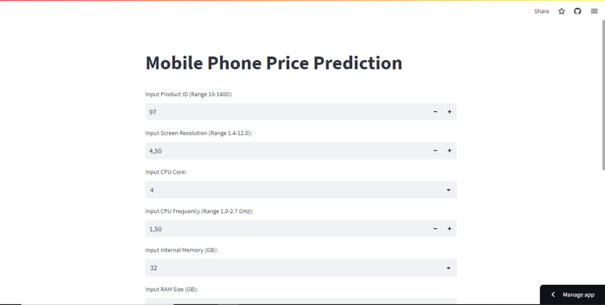

# Laporan Proyek Machine Learning
### Nama : Kresna Prayoga
### Nim : 211351071
### Kelas : Malam A

## Domain Proyek

Aplikasi prediksi harga mobile phone ini untuk pengguna yg sedang mencari referensi harga berbagai jenis handphone, atau bagi mereka yg ingin menjadi reseller handphone untuk di jual di pasar lokal.

## Business Understanding

Aplikasi ini dibuat agar pengguna dapat mencari harga handphone dari manapun itu tanpa perlu mensurvey langsung lokasi agar dapat menghemat waktu dan biaya.

Bagian laporan ini mencakup:

### Problem Statements

- Apakah pengguna dari indonesia dapat mencari harga pasar mobile phone?
- Bisakah kita mencari referensi harga mobile phone tanpa menghabiskan waktu dan biaya yg banyak?

### Goals

- ya,bisa bahkan aplikasi ini di lengkapi dengan konversi harga dari yuan(CYN) ke rupiah(IDR).
- bisa karena aplikasi ini dapat diakses dari mana saja jadi pengguna tidak perlu melakukan survey langsung ke tempat yg memerlukan waktu dan biaya yg banyak.

## Data Understanding
Dataset ini berasal jadi Kaggle yang berisi harga Mobile Phone. Dataset ini mengandung 161 baris dan lebih dari 10 columns setelah dilakukan data cleaning..<br> 


  [Mobile Price Prediction](https://www.kaggle.com/datasets/mohannapd/mobile-price-prediction).

Selanjutnya uraikanlah seluruh variabel atau fitur pada data. Sebagai contoh:  

### Variabel-variabel pada Mobile Price Prediction adalah sebagai berikut:

- Product_id : ID of each cellphone.<br> 
  type data : int64 <br> 
  range : 10-1400 <br> 
  satuan : -
- Price : Price of each cellphone.<br> 
  type data : int64 <br> 
  range : -<br> 
  satuan : CYN
- resoloution : Resoloution of each cellphone.<br> 
  type data : float64 <br> 
  range : 1,40-12,00<br> 
  satuan : pixel
- cpu core : Type of CPU core in each cellphone.<br> 
  type data : int64 <br> 
  range : 1,2,4,6,8<br> 
  satuan : -
- cpu freq : CPU Frequency in each cellphone.<br> 
  type data : float64 <br> 
  range : 1.0-2.7<br> 
  satuan : Hz
- internal mem : Internal memory of each cellphone.<br> 
  type data : float64 <br> 
  range : 4, 8, 16, 32, 64, 128<br> 
  satuan : GB
- ram : RAM of each cellphone.<br> 
  type data : float64 <br> 
  range : 0.128,0.256, 0.512, 1, 2, 3, 4, 6<br> 
  satuan : GB
- rear cam : Resolution of rear camera of each cellphone.<br> 
  type data : float64 <br> 
  range : 1.0-23.0<br> 
  satuan : MP
- front cam : Resolution of front camera of each cellphone.<br> 
  type data : float64 <br> 
  range : 1.0-20.0<br> 
  satuan : MP
- battery : Phone battery capacity.<br> 
  type data : int64 <br> 
  range : 800-9500<br> 
  satuan : mAh

## Data Preparation

### Data Collecting

  Pengambilan data disini saya mendapatkan datasetnya dari dari website kaggle bernama mobile price prediction, untuk link datasets sudah saya attach di bagian #data understanding.

  adapun library yg saya gunakan kali ini yaitu :
  ```
  import pandas as pd
  import numpy as np
  import matplotlib.pyplot as plt
  import seaborn as sns
  from sklearn.linear_model import LinearRegression
  from sklearn.model_selection import train_test_split
  ```
  dan library yg di gunakan untuk eksport dan import sav :
  ```
  import pickle
  ```

## Modeling

### Seleksi Fitur

pertama tama mari kita seleksi data yg akan di gunakan untuk prediksi :
```
features = ['Product_id','resoloution','cpu core','cpu freq','internal mem','ram','RearCam','Front_Cam','battery']
x = df[features]
y = df['Price']
x.shape, y.shape
```
untuk x nya saya mengambil kolom Product_id,resolution,cpu core,cpu frec,internal mem,ram,RearCam,Front_Cam,battery.

dan untuk y nya saya ambil colom price untuk dilakukannya prediksi.

### Split Data

lalu, saya lakukan split data untuk memangkas beberapa data yg di pakai.
```
x_train, x_test, y_train, y_test = train_test_split(x,y,random_state=70)
y_test.shape
```

### Model Regresi Linier

selanjutnya, saya melakukan pemodelan regresi linier sebagai berikut:
```
lr = LinearRegression()
lr.fit(x_train,y_train)
pred = lr.predict(x_test)
```

## Evaluation

saya menggunakan regresi linier sebagai matriks evaluasi saya :
```
score = lr.score(x_test, y_test)
print('akurasi model regresi linier = ', score)
```
dengan matriks tersebut saya mendapat akaurasi sebesar = 0.9176857915036091 atau sekitar 92%

## Deployment

Model yang sudah di buat di deploy menggunakan streamlit: 
Link Aplikasi: [Mobile Price Prediction](https://prediksi-harga-mobile-phone.streamlit.app/).



